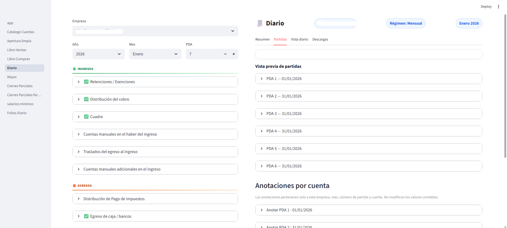
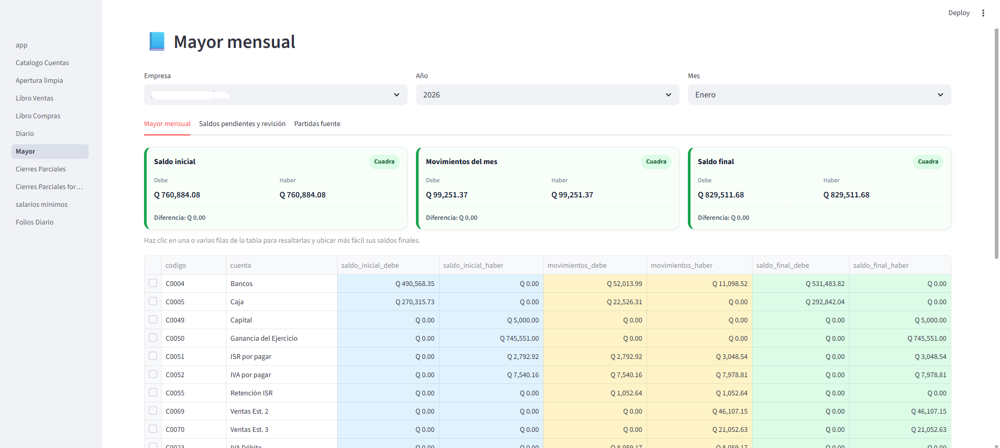

# Sistema Contable Automatizado

Sistema contable desarrollado con **Python y Streamlit** para automatizar procesos contables, reducir tareas manuales y facilitar la generación de reportes.

## Tecnologías utilizadas

- Python
- Streamlit
- SQLite
- JSON
- Excel
- OpenPyXL
- Pandas

## Funcionalidades principales

- Procesamiento de libros de compras y ventas
- Cálculo automático de impuestos
- Generación automática de partidas contables
- Elaboración de Libro Diario
- Elaboración de Libro Mayor
- Procesamiento de archivos Excel
- Clasificación de operaciones contables
- Generación de reportes
- Cierres contables parciales
- Manejo de catálogo de cuentas

## Objetivo del proyecto

Automatizar procesos contables que normalmente requieren trabajo manual, permitiendo reducir tiempo de procesamiento y facilitar el control de la información financiera,
como el procesar los libros de compras y ventas, ya que la agencia virtual nos proporciona un reporte con esos datos y en base a ese reporte se pueden crear los libros 
automáticamente a partir de eso, exceptuando el libro de compras ya que alli hay intervención manual del usuario las veces que sea necesario ya que se necesita clasificar 
las facturas en base al tipo de empresa, pero el sistema ya posteriormente en los meses siguientes lo recuerda exceptuando aquellas facturas nuevas si llegaran a aparecer
luego genera automaticamente las partidas de ingreso y egreso listas para verificarlas en el libro Diario donde el usuario podrá intervenir manualmente de acuerdo al estado
de cuenta de las empresas, o retenciones o exenciones o movimientos extraordinarios, o dejarlo como el sistema le indica si no hay estado de cuenta, en el estado de resultados
se puede agregar el inventario 2 o clasificar gastos no deducibles si se llegara a necesitar y ya con eso todo lo demás esta automatizado.

## Capturas del sistema

### Libro de Compras


### Libro de Diario


### Libro Mayor


## Estructura del proyecto

```text
sistema-contable-python/
│
├── app.py
├── requirements.txt
├── cuentas.json
├── salarios_minimos.json
├── pages/
└── utils/
```
